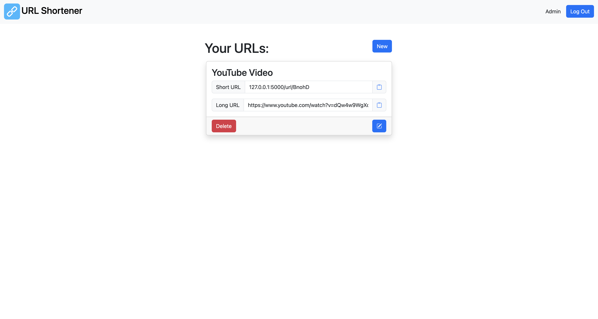
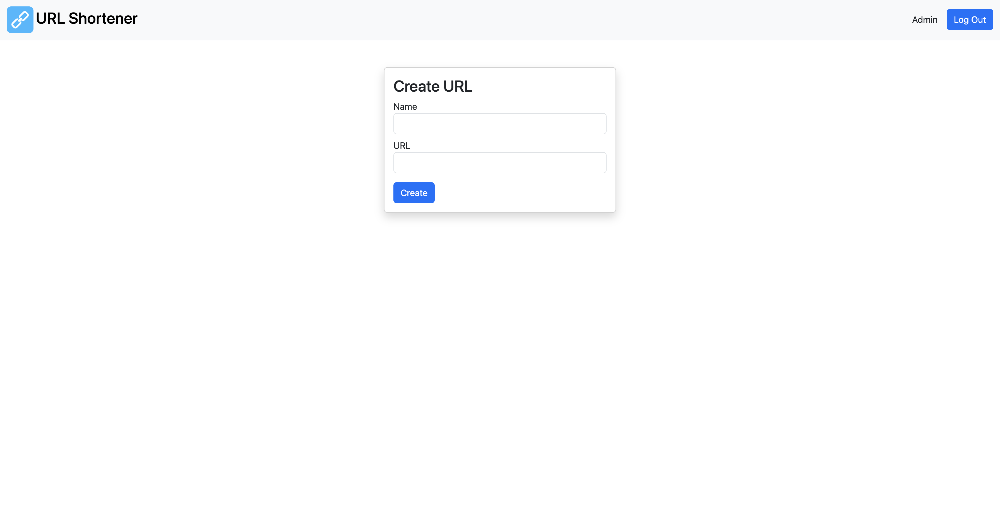

# url-shortener
URL shortening service written in Python (Flask)

Much of this project was adapted from Flask's [Blog site tutorial](https://flask.palletsprojects.com/en/2.3.x/tutorial/) 

## Example Images

Index page (light)

Index page (dark)

Create URL page