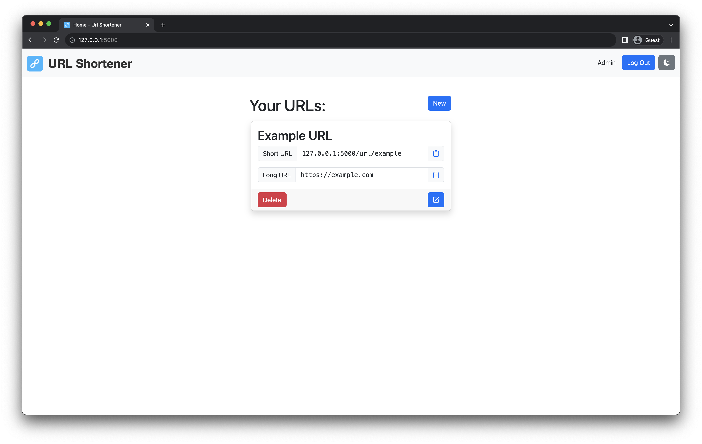
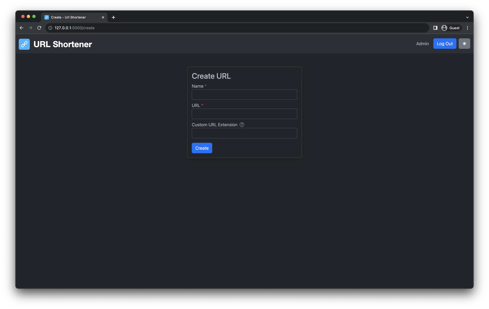

# URL Shortener

URL shortening service written in Python ([Flask](https://flask.palletsprojects.com/en/2.3.x/)), using Bootstrap to aid
with the front-end design.

The foundations of this project were adapted from
Flask's [Blog site tutorial](https://flask.palletsprojects.com/en/2.3.x/tutorial/)

My primary motivation for this project was to deepen my understanding of Flask, especially with regard to blueprints and
testing, as my prior experience was mostly limited to _very_ lightweight apps. I also wanted to have a project that I
could continually work on, and improve as I go.

So far, the aspect I most appreciate learning is writing / running tests (
with [Pytest](https://docs.pytest.org/en/7.4.x/) and [Coverage](https://coverage.readthedocs.io/en/7.3.0/)), as this is
an area I have typically neglected when developing previous projects.

## API Documentation

As part of my interest in aspects of development beyond just the code itself, I also put together some documentation for
the API that I have written to interact with the app. Although the app isn't actually hosted, you can view this
documentation [here](https://url-shortener-docs.readme.io/reference/getting-started-with-url-shortener-api).

## Example Images

Some examples of the UI.

Index page (light)

Index page (dark)

Create URL page (light)

Create URL page (dark)

Mobile (dark)

Mobile (light)